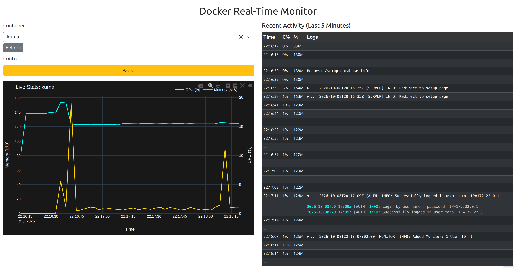

# py-docker-monitor

Real-time web dashboard to monitor a single Docker container's CPU, memory, and logs.

## Description

A Dash + Plotly app that connects to the local Docker daemon, polls a selected container once per second, and displays:

- Live CPU (%) and Memory (MiB) chart over the last 5 minutes (300 samples).
- Scrollable table of timestamped log lines with ANSI color rendering and collapsible long/multi-line entries; consecutive unchanged rows are collapsed into `...`.
- Pause/resume control and a refreshable container picker.

Stats collection runs in a background thread; the UI refreshes via a 1s Dash `Interval`.



## Requirements

- Python `>=3.13`
- A running Docker daemon reachable via the local socket (uses `docker.from_env()`)
- [`uv`](https://github.com/astral-sh/uv) for dependency management (provisioned via `mise` if installed)

## Setup

```bash
mise install
uv sync
```

## Run

```bash
uv run app.py
```

Open http://localhost:8050, click **Refresh**, then pick a container from the dropdown.

## Project Layout

- `app.py` — Dash app, background stats collector, callbacks.
- `pyproject.toml` — project metadata and dependencies.
- `mise.toml` — pins `uv` via mise.
